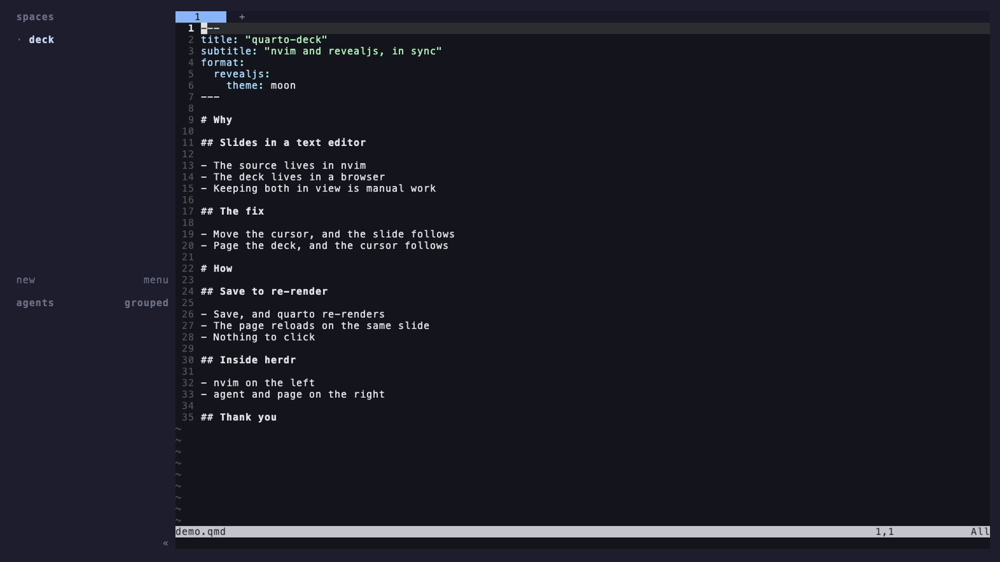

# quarto-deck

Keep a Quarto revealjs deck and your Neovim cursor in sync.



<sub>A screen recording of the real thing on macOS: Ghostty, herdr, nvim (NvChad) with
this plugin, and [terminal-browser](https://github.com/zenbu-labs/terminal-browser)
in the page pane. The claude pane is turned off for the recording.
[MP4](demo/quarto-deck-demo.mp4).</sub>

- Move the cursor in `slides.qmd` and the browser jumps to that slide.
- Page through the deck in the browser and the cursor follows.
- `:write` re-renders with `quarto`, and the page reloads on the slide you're editing.
- Inside [herdr](https://herdr.dev), it lays out the workspace for you:

```
+------------------+------------------+
|                  |  agent           |
|  nvim            |  (claude, ...)   |
|                  +------------------+
|                  |  page            |
|                  |  (terminal       |
|                  |   browser)       |
+------------------+------------------+
```

It's pure Lua with no runtime dependencies besides `quarto`. The server is a
small HTTP + Server-Sent Events server that runs inside nvim on libuv and binds
to `127.0.0.1` only.

## Install

Requires nvim ≥ 0.10 and `quarto`.

lazy.nvim:

```lua
{
  "hyunhwan-bcm/quarto-deck",
  ft = "quarto",
  cmd = "QuartoDeck",
  opts = {
    -- only if quarto isn't on PATH (you can also set $QUARTO_PATH)
    -- quarto = "/path/to/quarto",
  },
}
```

## Use

| Command | What it does |
|---|---|
| `:QuartoDeck start` | Serve the current `.qmd`, rendering it first if `slides.html` is missing or stale, then open it (herdr panes or the browser) |
| `:QuartoDeck stop` | Stop the server and close the page pane |
| `:QuartoDeck open` | Open the deck in the browser again |
| `:QuartoDeck render` | Re-render now |
| `:QuartoDeck layout` | Rebuild the herdr panes |
| `:QuartoDeck status` | URL, current slide / total, browser slide count, last render |
| `:QuartoDeck log` | Open the server/render log in a split |
| `:QuartoDeck url` | Copy the URL |

Rendering runs `quarto render slides.qmd --to revealjs` in the deck's
directory, so it writes `slides.html` and `slides_files/` next to the source,
the same way the decks' Makefiles do.

## herdr

When nvim runs inside a herdr pane (`HERDR_ENV=1`), `:QuartoDeck start` splits
the pane:

- **agent** (top right): runs `claude` if it's on PATH. `:QuartoDeck stop`
  leaves this pane open, since it holds your conversation. Set
  `herdr.close_agent = true` to close it too.
- **page** (bottom right): a terminal browser. The first one found is used:
  [terminal-browser](https://github.com/zenbu-labs/terminal-browser)
  (`brew install terminal-browser`; it needs a terminal with the kitty
  graphics protocol, such as Ghostty, kitty, or WezTerm), then `carbonyl`,
  `awrit`, or `browsh`. If none is installed, the deck opens in your system
  browser instead.

Outside herdr, the deck opens in the system browser.

### herdr plugin (keybindings)

`herdr-plugin/` is an optional herdr plugin that triggers the same commands
from herdr keys. It follows the pattern of
[yazi-popup](https://github.com/alastairsounds/herdr-plugins/tree/main/yazi-popup).
Each action checks that the focused pane is running nvim, and then sends
`:QuartoDeck <start|stop|render>` to it. If the pane isn't running nvim, the
action sends nothing and exits with an error.

```sh
herdr plugin install hyunhwan-bcm/quarto-deck/herdr-plugin
# or, from a local checkout:
herdr plugin link /path/to/quarto-deck/herdr-plugin
```

```toml
# ~/.config/herdr/config.toml
[[keys.command]]
key = "prefix+q"
type = "plugin_action"
command = "hyunhwan-bcm.quarto-deck.start"
description = "quarto deck: start"
```

The sync itself stays in the nvim plugin, because it needs cursor events. The
herdr plugin only triggers it.

## Configuration

Defaults:

```lua
require("quarto-deck").setup({
  quarto = vim.env.QUARTO_PATH or "quarto",
  render_args = { "--to", "revealjs" },
  host = "127.0.0.1",
  port = 0,              -- 0 = any free port
  auto_render = true,    -- re-render + reload on :write
  open = "auto",         -- "auto" | "herdr" | "browser" | "none"
  browser = nil,         -- nil = vim.ui.open; or { "firefox", "{url}" }; or function(url)
  sync_insert = false,   -- let the browser move the cursor in insert mode
  herdr = {
    cmd = "herdr",
    agent_cmd = nil,     -- nil = detect from agent_candidates; false = no agent pane
    agent_candidates = { { "claude" } },
    page_cmd = nil,      -- nil = detect; false = no page pane; e.g. { "carbonyl", "{url}" }
    page_candidates = {
      { "terminal-browser", "open", "{url}", "--no-merge" },
      { "carbonyl", "{url}" }, { "awrit", "{url}" }, { "browsh", "--startup-url", "{url}" },
    },
    ratio = 0.5,         -- herdr --ratio for nvim | right column
    agent_ratio = 0.5,   -- herdr --ratio for agent / page
    close_agent = false,
  },
})
```

## How sync works

Slides are addressed by their position in `Reveal.getSlides()`. The parser
(`lua/quarto-deck/parser.lua`) turns the `.qmd` into the same ordered list,
following Quarto's actual rules:

- the front-matter title slide
- headings at or above `slide-level`, including headings inside `:::` divs
- `visibility="hidden"` slides are dropped
- `---` rules start a slide, except directly before a heading
- content before the first heading becomes its own slide
- code fences and HTML comments are ignored

Horizontal and vertical (stacked) navigation both work, because the browser
turns the position into `h/v` indices itself.

When the browser connects, it reports its slide count. If that differs from
the parser's count, you get a warning instead of silently landing on the
wrong slides.

## Limitations

- `` files and shortcodes that generate slides aren't expanded,
  so the counts differ. You'll see the mismatch warning.
- Fragments aren't synced, only slides.
- Narrow panes put Reveal into its scroll view. Sync works there, but Reveal
  has a bug that mis-maps slides inside vertical stacks, so in scroll view the
  client jumps by scrolling instead of calling `Reveal.slide`.
- One deck at a time per nvim.

## Tests

Everything runs headless: `nvim --headless`, and for the end-to-end test
headless Chrome driven over the DevTools protocol by a small Lua WebSocket
client. There's no node, curl, or plenary dependency.

```sh
make unit     # parser, HTTP/SSE server, plugin sync, herdr layout (fake herdr CLI)
make e2e      # real quarto: parser parity + nvim <-> Chrome (real key presses, and a
              # narrow viewport where Reveal switches to scroll view)
make herdr    # herdr plugin + layout on a private headless herdr server
make herdr-tb # same, with a real terminal-browser in the page pane
make test     # all of it; a missing tool is reported as SKIP
make strict   # unit + e2e with skips counted as failures (CI)
```

`make herdr` never touches your running herdr session. It points
`XDG_CONFIG_HOME` and `XDG_STATE_HOME` at a temp dir and clears the `HERDR_*`
variables, which gives it a private server (the trick from herdr-plugins'
justfile). It then links the plugin, runs nvim in a pane, and invokes the
actions the way a keybinding would. Finally it checks the pane geometry, sync
in both directions through herdr keystrokes, `stop`, and that the action
refuses a pane that isn't running nvim.

`QUARTO_DECK_EXTRA=/path/deck/slides.qmd:... make e2e` also checks the parser
against your own decks. Each deck's directory is copied to a temp dir first, so
the original is never rendered.

## License

MIT
